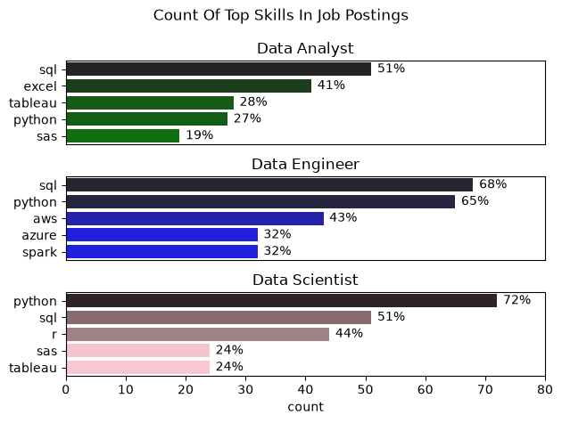
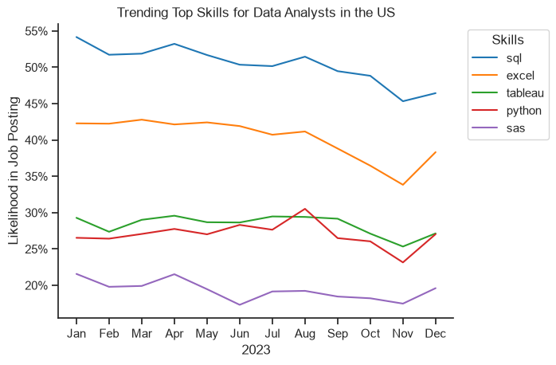
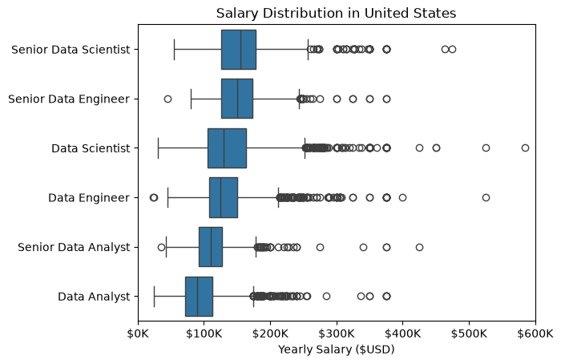
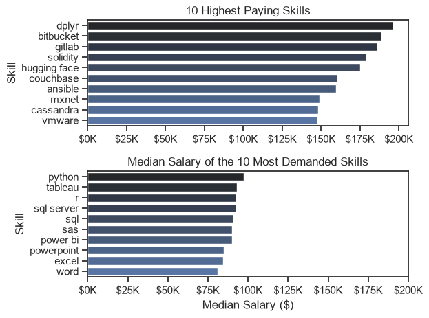
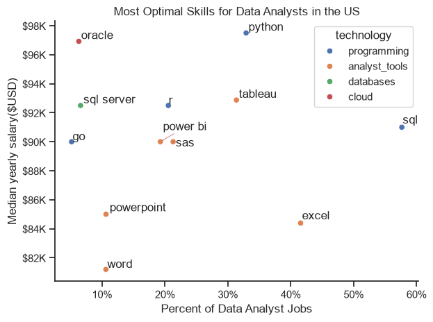

# Overview:
This project analyzes the US data analyst job market using real-world job posting data from Luke Barousse's Python Course. The goal is to understand which skills are most in demand, how skill demand changes over time, and how different skills relate to salary.

# The Questions:
1. What are the skills most in demand for the top 3 most popular data roles?
2. How are in-demand skills trending for Data Analysts?
3. How well do jobs and skills pay for Data Analysts?
4. What are the optimal skills for Data Analysts to learn based on both demand and salary?

# Tools Used
For this analysis of the data analyst job market, I used the following tools:

- Python: Used as the main programming language for cleaning, analyzing, and exploring the data.
- Pandas: Used for data manipulation, filtering, grouping, and analysis.
- Matplotlib: Used to create data visualizations.
- Seaborn: Used to create more detailed and visually appealing visualizations.
- Jupyter Notebooks: Used to run and document the analysis, allowing me to combine code, visualizations, and explanations.
- Visual Studio Code: Used to write and organize my Python code and project files.
- Git & GitHub: Used for version control and to store and share the project's code and analysis.

# The Analysis

## 1. What are the skills most in demand for the top 3 most popular data roles?

To find the most demanded skills for the top 3 demanded data roles, I filtered out those positions by which ones where the most popular, and got the top 5 skills for these top 3 roles. This query highlights the most popular job titles and their top skills, showing which skills I should pay attention to depednign on the role I'm targetting. 

View my notebook with detail steps here: [2_skills_demand.ipynb](3_Project/2_skill_demand.ipynb)

### Visualise Data
```fig,ax = plt.subplots(3,1)
for i, job_title in enumerate(job_titles):
        plot = skills_perc[skills_perc['job_title_short'] == job_title].sort_values(ascending = False, by = 'skill_count').head(5 )
        sns.barplot(data = plot , x = 'percent', y = 'job_skills', ax = ax[i], hue = 'skill_count', palette = color[i], legend = False)
        ax[i].set_title(job_title)
```
### Results


### Insights:
-  SQL is the most demanded skill for Data Analysts (51%), Data Engineers (68%), and is also highly demanded for Data Scientists (51%).
-  Python is the most demanded skill for Data Scientists (72%) and is also highly demanded for Data Engineers (65%).
-  Data Analysts rely more heavily on SQL and Excel, with SQL at 51% and Excel at 41%.
- Data Engineers have a stronger focus on cloud and big- data technologies, with AWS at 43% and Azure and Spark at 32%.
- Data Scientists show a stronger emphasis on programming, with Python at 72% and R at 44%.
- Tableau and SAS appear among the top skills for both Data Analysts and Data Scientists, but are less prominent for Data Engineers.
- Overall, the skills vary by role: Data Analysts emphasize SQL and Excel, Data Engineers emphasize SQL, Python, and cloud technologies, while Data Scientists emphasize Python and statistical/programming tools.

## 2. How are in demand skills trending for Data Analysts?

### Visualise Data
``` 
from matplotlib.ticker import PercentFormatter

sns.lineplot(data=plot, dashes=False, palette='tab10')
sns.set_theme(style = 'ticks')
sns.despine()

ax = plt.gca()
ax.yaxis.set_major_formatter(PercentFormatter(decimals = 0))
plt.show()

```

### Results



### Insights:
- SQL remains the most demanded skill throught the whole year, althought the demand for it gradually decreases throughtout the year.
- Excels demand stays roughly constamnt throughtout the year. However, the demand for it drops significantly from August to Novemeber. Yet, the demand for it recovers after November and increases significantly. It's acctually the skill that has the steepest rise in demand by the end of the year.
- Tableu and Python remain constant throughout the year, having relatively the same demand.
- Sas has the lowest demand overall in comparison to the other four skills.

## 3. How well do jobs and skills pay for Data Analysts?

### Visualise Data
```
df_US = df[(df['job_country'] == 'United States')].dropna(subset = ['salary_year_avg'])

job_titles = df_US['job_title_short'].value_counts().index[:6].to_list()

top_6 = df_US[df_US['job_title_short'].isin(job_titles)]

job_order   = top_6.groupby('job_title_short')['salary_year_avg'].median().sort_values(ascending = False).index


sns.boxplot( data = top_6, x = 'salary_year_avg', y =  'job_title_short', order = job_order )
ax = plt.gca()
ax.xaxis.set_major_formatter(plt.FuncFormatter(lambda x, _ : f'${int(x/1000)}K'))
plt.xlim(0,600000)
plt.title('Salary Distribution in United States')
plt.xlabel('Yearly Salary ($USD)')
plt.ylabel('')
plt.show()
```
### Results


### Insights:
- Senior Data Scientist and Senior Data Engineer have the highest median salaries among the roles shown.
- Data Analyst has the lowest median salary, with the median around $90K.
- Senior Data Analyst has a higher median salary than Data Analyst, showing an increase in salary with seniority.
- Data Scientist and Data Engineer have wider salary distributions and more high- end outliers than Data Analyst.
- All roles contain outliers with salaries substantially higher than their typical range.
- Overall, the graph shows clear differences in salary distributions between data- related roles, with more senior and specialized roles generally having higher salary ranges.


## 4. What are the optimal skills for Data Analysts to learn based on both demand and salary?

### Highest Paid and Most Demanded Skills
### Visualise Data
```
grouped_m = grouped_m.head(10).sort_values(by = 'median', ascending = False)
grouped_c =grouped_c.head(10).sort_values(by = 'median', ascending = False)

fig, ax = plt.subplots(2, 1)
sns.set_theme(style = 'ticks')

sns.barplot(data = grouped_m, x='median', y=grouped_m.index, ax=ax[0], hue= 'median',  palette='dark:b_r', legend=False)

ax[0].set_title('10 Highest Paying Skills')

ax[0].set_ylabel('Skill')
ax[0].xaxis.set_major_formatter(plt.FuncFormatter(lambda x, _: f'${int(x/1000)}K'))


sns.barplot(data = grouped_c, x= 'median', y=grouped_c.index, ax=ax[1], hue='median', palette='light:b', legend=False)

ax[1].set_title('Median Salary of the 10 Most Demanded Skills')
ax[1].set_xlabel('Median Salary ($)')
ax[1].set_ylabel('Skill')
ax[1].set_xlim(0, 200000)
ax[1].xaxis.set_major_formatter(plt.FuncFormatter(lambda x, _: f'${int(x/1000)}K'))

plt.tight_layout()
plt.show()
```
### Results



### Insights:
- Python has the highest median salary among the 10 most demanded skills, at around $97K.
- Tableau and R follow closely, with median salaries around $93K.
- SQL is one of the most demanded skills and has a median salary of around $91K.
- Excel, PowerPoint, and Word have lower median salaries, around $80–85K.
- The most demanded skills generally have median salaries between $80K and $100K.
- This shows that the most commonly requested skills are not necessarily the highest- paying skills overall.


### Most Optimal Skills for Data Analysts in the US

### Visualise Data

```
for key, value in technology_dict.items():
     technology_dict[key] = list(set(value))

df_technology = pd.DataFrame(list(technology_dict.items()),columns=['technology', 'skills'])
df_technology = df_technology.explode('skills')

plot_df = high_demand.reset_index().merge(
    df_technology,
    left_on='job_skills',
    right_on='skills').drop_duplicates(subset='job_skills')

fig, ax = plt.subplots()

# plot_df.plot(kind='scatter',x='skill_percentage',y='median_salary',ax=ax)
sns.scatterplot(data = plot_df, x='skill_percentage', y='median_salary',hue = 'technology', ax=ax)
sns.despine()
sns.set_theme(style = 'ticks')
plt.xlabel('Percent of Data Analyst Jobs')
plt.ylabel('Median yearly salary($USD)')
plt.title('Most Optimal Skills for Data Analysts in the US')

texts = []
from matplotlib.ticker import PercentFormatter
for txt in plot_df['job_skills']:

    row = plot_df[plot_df['job_skills'] == txt].iloc[0]
    text = plt.text(row['skill_percentage'],row['median_salary'],txt)
    texts.append(text)

adjust_text(texts,arrowprops=dict(arrowstyle='- >', color='r', lw=0.5))

ax.yaxis.set_major_formatter(plt.FuncFormatter(lambda y, pos: f'${int(y/1000)}K'))
ax.xaxis.set_major_formatter(PercentFormatter(decimals = 0))
plt.tight_layout()
```
### Results


### Insights:
- Programming skills generally have relatively high median salaries. Python has the strongest combination of demand and salary, while R and Go are also associated with relatively high salaries.
- Analyst tools such as Excel, PowerPoint, Word, Power BI, SAS, and Tableau generally have lower median salaries, although Tableau is an exception with a median salary around $93K.
- Database- related skills such as SQL Server have relatively high salaries despite being less commonly requested than SQL.
- Cloud- related skills, particularly Oracle in this dataset, have high median salaries but relatively low demand.
- The graph shows that the technology category can help explain differences in salary and demand between skills. - Programming and some database/cloud skills tend to appear toward the higher- salary region, while many analyst tools are concentrated lower down.
- Overall, the graph suggests that the most common skills are not necessarily the highest- paying, and the relationship between demand and salary differs across technology categories.